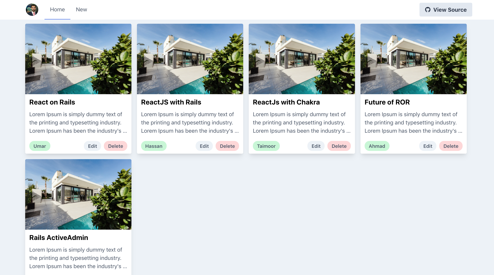

<h3 align="center">ReactRails Blog App</h3>

This app shows you how to create a CRUD app with ROR on back-end and React on front-end with Tailwindcss.

## This project will help you:

- To configure and create a CRUD Rails application with React.
- To configure and use Tailwind in React-Rails(RR) app.
- To show custom alert messages by using Tailwind.

## What this App does?

- By this app, you will be able to:

  - Create a new Blog.
  - Edit a Blog.
  - Delete a Blog.
  - Get a speicific Blog.
  - Get list of all Blogs.

## Built with

- Ruby on Rails
- Reactjs (react hooks, react router)
- React-icons
- Tailwind used for styling

## Setup

- Clone the repository
- Use `cd <repository-path>`
- Run `bundle install`
- Run `npm install`
- Run `rails db:create`
- Run `rails db:migrate`
- Run `rails db:seed`
- Run `rails s`
Now check it on browser `localhost:3000`

## Author

Muhammad Ahmad

- Github: [@Ahmad](https://github.com/MA-Ahmad)

- LinkedIn: [Muhammad Ahmad](https://www.linkedin.com/in/muhammad-ahmad20/)

## 🤝 Contributing

Contributions, issues and feature requests are welcome! Start by:

- Forking the project
- Cloning the project to your local machine
- `cd` into the project directory
- Run `git checkout -b your-branch-name`
- Make your contributions
- Push your branch up to your forked repository
- Open a Pull Request with a detailed description to the development branch of the original project for a review

## Show your support

Give a ⭐️ if you like this project!